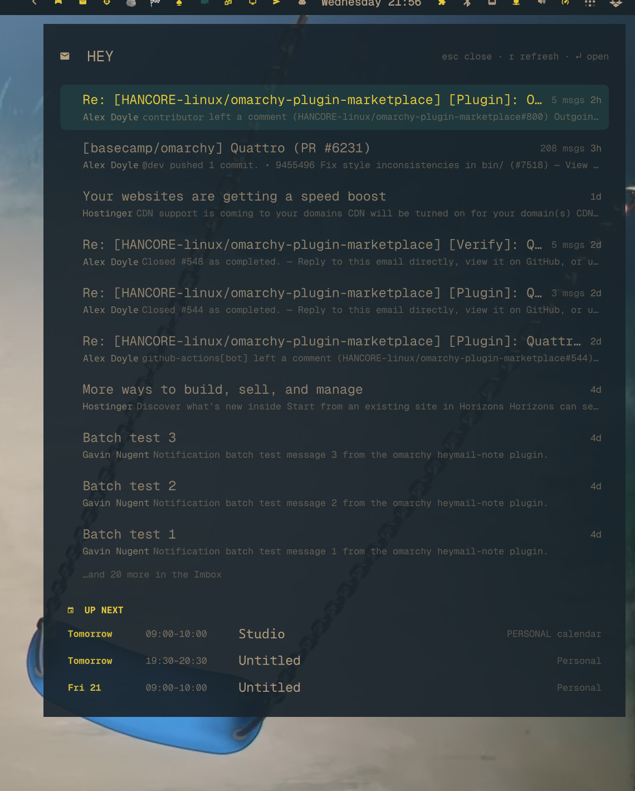

# HEY-CAL

Your HEY Imbox and your next few calendar events, in one panel on your Omarchy
desktop. Press the shortcut, glance, press `↵` to open whatever you were
looking at in the browser, and get back to what you were doing.

It is a **native plugin for the Omarchy 4 desktop shell** (`omarchy-shell`):
an envelope in the bar, and a card that drops out of it.

<p align="center">
  
</p>

The top of the card is the **Imbox** — the ten most recent threads, unread ones
in bold with a dot, each showing who it is from, a snippet, the thread size and
how long ago it moved. Underneath, in its own slab, is **Up next**: the next few
things on your HEY Calendar, whichever calendar they live on.

Everything is **read-only**. Nothing here marks mail seen, archives, replies or
sends, and nothing edits your calendar. The panel shows you what is there and
gets out of the way.

## Requirements

- **Omarchy 4** (the `omarchy-shell` desktop).
- **[hey-cli](https://github.com/basecamp/hey-cli)** — HEY's own command-line
  client, from 37signals. The plugin never sees your password or token; it asks
  the `hey` command for data the same way you would at a prompt.

  There are no published binaries, so it is a build from source (Go 1.26+).
  `hey-cli` publishes no tags and no releases, so `main` is a moving target —
  check out the exact commit this plugin was verified against rather than
  whatever `main` happens to be:

  ```sh
  git clone https://github.com/basecamp/hey-cli &&
    cd hey-cli &&
    git checkout --detach 22aeea730eb28a70ccbc1701027d4883715914a9 &&
    mise install &&
    make install
  ```

  It is one `&&` chain on purpose: if the checkout fails, nothing goes on to
  build whatever `main` happens to be. `mise install` picks up Go 1.26.1 from
  the repo's own `.mise.toml`, and `make install` ends in `sudo install`, so
  expect a password prompt. Then sign in — browser-based OAuth, no password
  ever reaches this plugin:

  ```sh
  hey auth login
  ```

  A newer commit will very likely work — but the JSON this plugin parses is
  unversioned, so nothing upstream signals a breaking change. Building the
  pinned commit means you get the shape that was tested. If you'd rather track
  `main`, do, and read the note at the end of this section first.

  Two things to avoid. The AUR `hey-cli` package pins a `v0.0.1` tag that does
  not exist upstream, so its download 404s. And `hey` is not a unique name —
  `hey-bin` and `hey-git` package an **HTTP load generator** that also installs
  a binary called `hey`. Only Basecamp's will do here, and the panel checks: it
  identifies the binary before passing it any arguments, and says plainly if the
  `hey` it found is the wrong one.

  `hey auth status` should be happy before you open the panel. If it isn't, the
  panel tells you so rather than showing an empty list.
- **jq**, which is almost certainly already installed.

Everything this plugin parses — `.data.postings`, `.data["Calendar::Event"]`,
`app_url`, `edit_url` — was verified against commit
[`22aeea7`](https://github.com/basecamp/hey-cli/commit/22aeea730eb28a70ccbc1701027d4883715914a9)
and nothing else. The parser is defensive, so a shape change degrades to an
error note rather than a broken panel, but it can't self-diagnose: if a fetch
comes back wrong after you move the CLI forward, that is the first thing to
suspect.

## Install

Installing the plugin does **not** install `hey-cli` — a plugin install is a git
clone, so it cannot place binaries or pull packages. Set the CLI up first, or
the panel will open and tell you it can't find it.

```sh
omarchy plugin add https://github.com/28allday/omarchy-hey-cal.git
omarchy-shell shell rescanPlugins
omarchy plugin enable nosignal.hey-cal --section right
```

That puts an envelope in the right-hand side of your bar. Click it to open the
panel.

To reach it from the keyboard, add a binding to `~/.config/hypr/bindings.lua`:

```lua
o.bind("SUPER + ALT + H", "HEY", "omarchy-shell shell toggle nosignal.hey-cal")
```

Bindings are picked up as soon as you save the file.

## Removing it

To take the icon out of the bar but keep the plugin installed:

```sh
omarchy plugin disable nosignal.hey-cal
```

To remove it altogether:

```sh
omarchy plugin remove nosignal.hey-cal
```

That deletes the clone and takes the icon back out of `bar.layout`.

One line survives it: the `{"id": "nosignal.hey-cal"}` entry in `plugins[]`
described below. `omarchy plugin remove` clears the *first* entry it finds for a
plugin, and this one has two, so it clears the bar icon and stops. The leftover
is inert — the shell skips an entry whose plugin is not installed — but if you
would rather the file were tidy:

```sh
cfg=~/.config/omarchy/shell.json
jq 'del(.plugins[]? | select(.id == "nosignal.hey-cal"))' "$cfg" > "$cfg.tmp" &&
  mv "$cfg.tmp" "$cfg"
```

Two more things removal can't clean up, because they aren't the plugin's to
touch:

- **The keybinding**, if you added one — that line is yours, in your
  `bindings.lua`. Delete it or it will toggle a panel that is no longer there.
- **`hey-cli`**, which you installed separately and may well be using outside
  this plugin. `sudo rm /usr/local/bin/hey` if you want it gone, and
  `hey auth logout` first to drop its stored session — the keyring entry, or
  `~/.config/hey-cli/credentials.json` on a box where it fell back to the
  plaintext file.

## Using it

| Key | Does |
| --- | --- |
| `↓` `↑` or `j` `k` | Move the cursor. It runs through the mail and straight on into the agenda. |
| `Home` `End` | First row / last row. |
| `↵` | Open the selected row in your browser — a mail thread at that thread, an event at that event. |
| `r` or `F5` | Fetch again. |
| `Esc` or `q` | Close. Clicking outside the card closes it too. |

The mouse does the same things: hover to move the cursor, click a row to open
it.

## How much it shows

Ten threads and four events, which is what fits without the card becoming a
second inbox. If the Imbox has more, a line under the list tells you how many
are waiting.

Both numbers live at the top of `Panel.qml` and are a one-line change each:

```qml
property int mailLimit: 10
property int eventLimit: 4
```

Only events that are still ahead of you are listed. A timed event stays up
until it ends; an all-day event stays up for the whole of its day.

## What it does on your machine

Worth knowing before you install anything that can read your mail:

- **It fetches only when you open it.** Nothing polls. Close the panel and it
  makes no requests at all; leave it open and it still makes none until you
  press `r`. The bar icon is a static icon, not a live unread badge — a badge
  would mean hitting HEY on a timer, which is the one thing this deliberately
  does not do.
- **It reads, it never writes.** The only commands it runs are `hey box imbox`,
  `hey calendars` and `hey recordings`, all with `--json`.
- **It stores nothing itself.** No cache, no mail on disk, no credentials —
  your HEY session belongs to `hey-cli` and is never read here. Where that
  session actually lives depends on your machine: `hey-cli` keeps it in the
  system keyring when one is available, but **falls back to a plaintext file**,
  `~/.config/hey-cli/credentials.json` (created `0600`), in two cases: when no
  keyring is reachable — that one is announced with a warning on stderr — and
  when `HEY_NO_KEYRING` is set, which switches to the plaintext file
  **silently**, no warning at all. And because
  every `hey` command refreshes an expiring token automatically, even this
  plugin's read-only fetches can cause `hey-cli` to rewrite that file. If the
  plaintext fallback bothers you, make sure a Secret Service keyring is running
  before `hey auth login` — `hey doctor` reports which store is in use.
  (Behaviour verified against the pinned `hey-cli` build, `22aeea7`.)
- **It writes one line to your shell config.** The first time the panel opens it
  adds `{"id": "nosignal.hey-cal"}` to the `plugins[]` array in
  `~/.config/omarchy/shell.json`, if it is not already there. This is what keeps
  the keyboard shortcut working when the bar icon is not in the bar — without
  it, removing the icon silently kills the shortcut. It is idempotent, it adds
  only that one entry, it never removes anything, and it writes through a
  temporary file. Removing the plugin leaves this one line behind — see
  [Removing it](#removing-it) for why, and the one command that clears it.
- **Opening a row launches your browser**, whichever one you have set as
  default, through Omarchy's own `omarchy-launch-browser`. Only `https://` links
  are ever passed on.
- Subjects, senders and snippets are rendered as **plain text**, never as
  markup, so nothing in an email can draw or load anything in your bar.

## Scope

- **Imbox only.** Not the Feed, Reply Later, Set Aside, Paper Trail or Bubble
  Up. If it is not in the Imbox it is not here.
- **Events only.** Habits and todos are not shown; this is an agenda, not a task
  list.
- **No composing.** Open the thread in HEY to reply.

## Related

Two single-purpose plugins do the halves separately, if that suits you better:
one is the Imbox on its own, the other the full 30-day agenda grouped by day.
This one is the merge of the two.

## Licence

MIT — see [LICENSE](LICENSE).

Not affiliated with, endorsed by, or connected to Basecamp or HEY.
